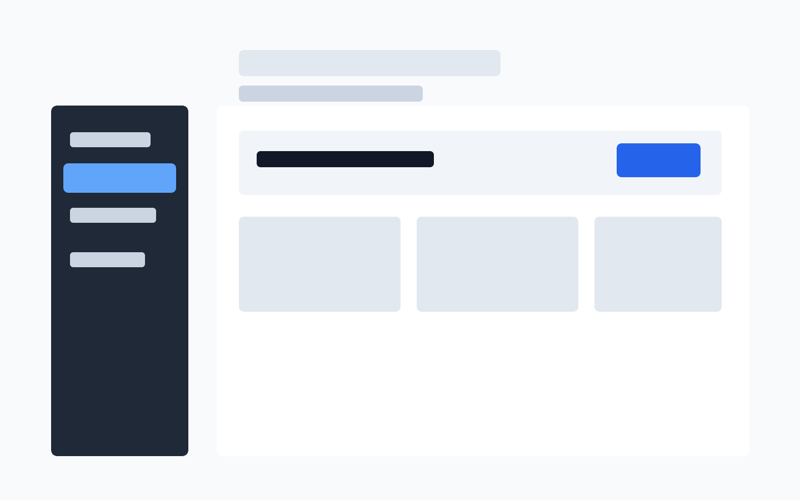
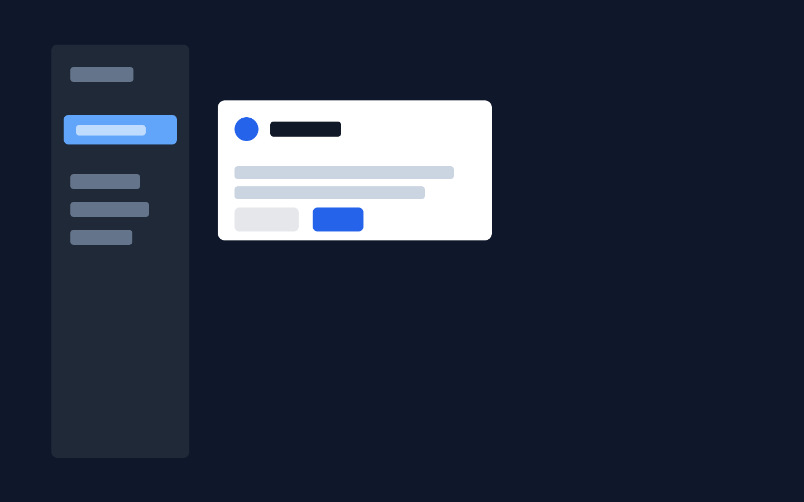
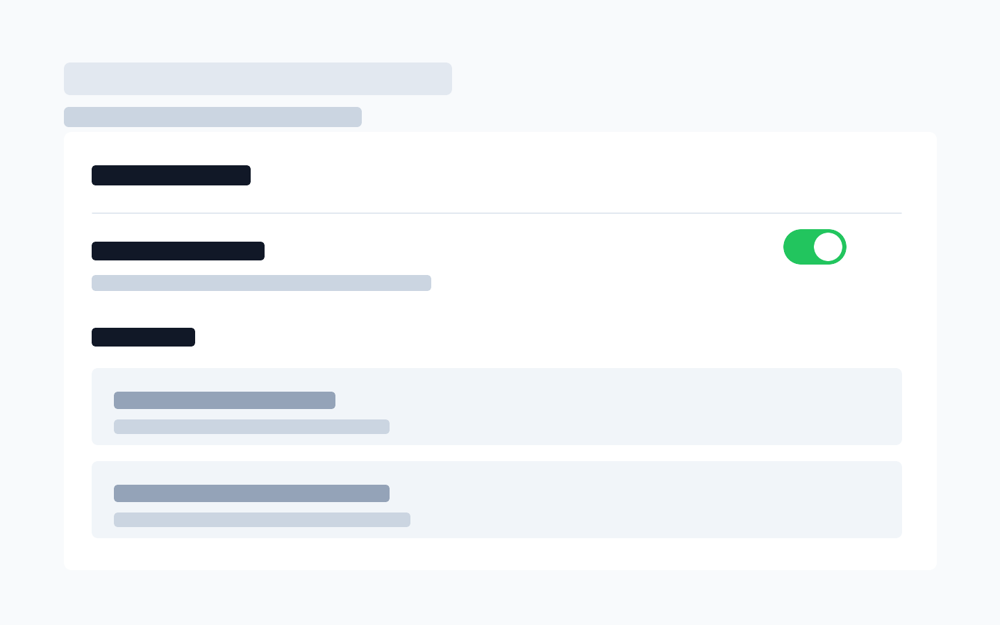
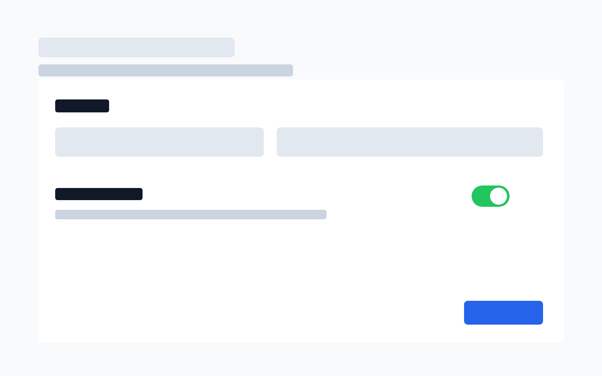

# Using Welcome Tour

This guide is for owners and operators who set up the admin onboarding tour, and for anyone who wants to take it again. The welcome tour is a short, step-by-step walkthrough that points new admins at the main areas of the admin. No technical knowledge needed. Every step uses the labels you see on screen.

## Using Welcome Tour (how-to)

### How to take the welcome tour as a new admin

1. Sign in and open the admin dashboard.
2. If the tour is on and you have not dismissed it, it starts on its own and shows the first step.
3. Read each step, then move forward to the next one. The tour highlights the menu, header tools, sites, pages, media, and the dashboard.
4. If you would rather not do it now, choose **Remind me later** to pause it until tomorrow.

### How to turn the welcome tour on

1. Open the **Welcome tour** settings in the admin.
2. Switch on **Enable welcome tour**. This allows the tour to be shown to admins. Per-user preferences only take effect while this is on.
3. Save.

### How to edit the tour steps

1. Open the **Welcome tour** settings.
2. Find **Tour steps**. Each step is one pointer in the tour.
3. To add a step, add a new item and fill in:
    - **Title**: the heading for the step.
    - **Description**: the text the admin reads.
    - **Icon** and **Icon color**: optional, to give the step a visual cue.
    - **Sort**: a number that sets the order. Lower numbers come first.
    - **Visible**: leave on for the step to appear.
4. To change the order, drag the steps into the sequence you want.
5. Save when you are happy.

Keep the tour short and focused on the first few things a new admin needs. Update the steps whenever your admin screens change so the tour stays accurate.

### How to limit a step to certain admins

1. Open the **Welcome tour** settings and edit the step.
2. In **Roles**, enter the role names that should see this step, separated by commas. Leave it empty to show the step to all admins.
3. Use **First-run days** to show the step only to recently created accounts. Enter the number of days after a user is created during which the step appears.
4. Save.

### How to restart the tour for yourself

1. Open the option to **Restart tour** from the dashboard.
2. The tour will start again the next time the dashboard loads.

### How to let a specific user see the tour again

1. Go to the user's account in **Users** and open their edit form.
2. Switch on **Show welcome tour**. This controls whether the tour is available for that user account.
3. Save. The next time that user opens the dashboard, the tour is available to them again.

## Rolling out Welcome Tour (for owners)

### Turn on first

- **Enable welcome tour** with a short set of steps. Get the core walkthrough working before you tailor it.

### Add when needed

| Need                                   | What to use                                                 |
| -------------------------------------- | ----------------------------------------------------------- |
| Point new admins at your key screens   | **Tour steps** with a clear **Title** and **Description**   |
| Show some steps only to certain people | The step **Roles** field                                    |
| Show steps only to brand-new accounts  | The step **First-run days** field                           |
| Let someone retake the walkthrough     | **Restart tour**, or **Show welcome tour** on their account |

### Who does what

| Role       | First useful screen                                         |
| ---------- | ----------------------------------------------------------- |
| New admin  | The dashboard: take the tour, or choose **Remind me later** |
| Site owner | **Welcome tour** settings: turn it on and edit the steps    |

## Troubleshooting

| What you see                         | What it means                                                  | What to do                                                     |
| ------------------------------------ | -------------------------------------------------------------- | -------------------------------------------------------------- |
| The tour does not appear for anyone  | **Enable welcome tour** is off                                 | Open the settings and switch on **Enable welcome tour**        |
| One admin never sees the tour        | That user's **Show welcome tour** is off, or they dismissed it | Open their account and switch on **Show welcome tour**         |
| A step shows for the wrong people    | The step **Roles** or **First-run days** limit it              | Edit the step and adjust **Roles** or clear **First-run days** |
| A step is unclear or out of date     | The screen it describes has changed                            | Edit the step's **Description** in the settings                |
| The tour keeps interrupting an admin | They want to do it later                                       | They can choose **Remind me later** to pause it until tomorrow |
